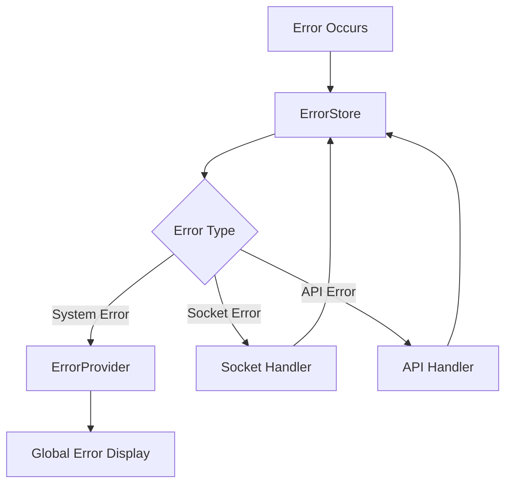
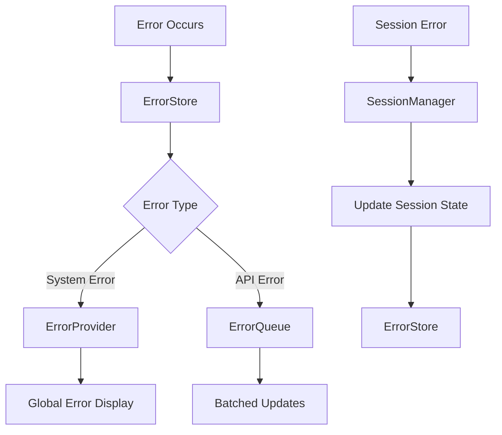

# Error Notification System Analysis

## 1. System Architecture

### Components
1. **ErrorStore** (stores/ErrorStore.js)
   - Zustand store for error state
   - Error deduplication (5 second window)
   - Error queueing
   - Error categorization

2. **ErrorProvider** (ErrorNotificationSystem.jsx)
   - React context provider
   - Error display handling
   - Event emitting (mitt)
   - Global error notifications

3. **ServiceMatrix** (ServiceMatrix.jsx)
   - Main app container
   - Integration with ErrorStore
   - Socket event handling
   - Layout management

### Current Flow


## 2. Data Flow Analysis

### State Management Issues
1. **Multiple State Sources**
   - ErrorProvider maintains error state
   - ServiceMatrix has local error state
   - Session state affects error handling
   - Socket state influences error display

2. **State Update Chains**
   ```
   Error occurs
   → handleError called
   → showError triggered
   → state updated in ErrorProvider
   → triggers session check
   → triggers layout refresh
   → potentially triggers new errors
   ```

3. **Circular Dependencies**
   - Session errors trigger refreshes
   - Refreshes can trigger new errors
   - Error dismissal triggers session validation
   - Layout updates trigger socket events
   - Socket events trigger session refresh

## 3. Key Issues Identified

### 1. Session Management
- Session checks are too aggressive
- Every error triggers session validation
- Session updates cause unnecessary refreshes
- No clear distinction between critical and non-critical session errors

### 2. Error Handling Architecture
- Mixing of concerns between error display and system state
- No clear error type hierarchy
- Inconsistent error handling patterns
- Missing error categorization

### 3. State Management
- Too many interconnected state updates
- No clear state ownership
- Missing error state normalization
- Unnecessary rerender triggers

### 4. Socket Event Handling
- Over-aggressive refresh on socket events
- Missing socket event debouncing
- Socket errors trigger full refreshes
- No socket error categorization

## 4. Recommended Fixes

### 1. Separate Concerns
```javascript
// Create distinct systems for:
1. Error Display
2. Session Management
3. Socket Event Handling
4. Layout Management
```

### 2. Error Categorization
```typescript
/**
 * @typedef {'system' | 'ui' | 'session' | 'socket' | 'api'} ErrorType
 * @typedef {'high' | 'medium' | 'low'} ErrorPriority
 * 
 * @typedef {Object} ErrorItem
 * @property {string} id
 * @property {string} message
 * @property {ErrorType} type
 * @property {ErrorPriority} priority
 * @property {number} timestamp
 * @property {string} [componentName]
 * @property {string} [stack]
 */
```

### 3. State Management
1. **Implement Error Queue**
   - Prioritize errors
   - Batch updates
   - Prevent cascading refreshes

2. **Session Management**
   - Implement session state machine
   - Separate session validation
   - Debounce session checks

3. **Socket Event Handling**
   - Implement event buffering
   - Add event prioritization
   - Separate socket state

## 5. Implementation Plan

### ~~Phase 1: Error System Isolation~~ (COMPLETED May 4, 2025)
1. ~~Create dedicated ErrorStore~~
2. ~~Remove session dependencies~~
3. ~~Implement error queue~~
4. ~~Add error categorization~~

### Phase 2: Session Management
1. Create SessionManager class
2. Implement session state machine
3. Add session validation rules
4. Decouple from error system

### Phase 3: Event Handling
1. Implement EventBus
2. Add event prioritization
3. Implement event buffering
4. Separate socket handling

## 6. Best Practices

### Error Handling
1. Always categorize errors
2. Use error boundaries appropriately
3. Implement proper error queuing
4. Avoid circular error chains

### State Management
1. Single source of truth
2. Clear state ownership
3. Predictable state updates
4. Proper state isolation

### Event Handling
1. Event debouncing
2. Clear event hierarchy
3. Proper event buffering
4. Event prioritization

## 7. Code Examples

### Error Store
```typescript
class ErrorStore {
  private errorQueue: Error[];
  private errorMap: Map<string, Error>;
  
  addError(error: Error) {
    // Add to queue based on priority
    // Prevent duplicates
    // Handle state updates
  }
  
  removeError(id: string) {
    // Remove from queue
    // Clean up state
    // No session checks
  }
}
```

### Session Manager
```typescript
class SessionManager {
  private sessionState: SessionState;
  
  validateSession() {
    // Check session state
    // No error triggers
    // Return state only
  }
  
  handleSessionError(error: Error) {
    // Update session state
    // No cascading refreshes
    // Clear error handling
  }
}
```

## 8. Error System Flow

### Core Principles
1. All errors are handled through the ErrorStore
2. Errors are categorized and prioritized
3. No circular dependencies between systems
4. Clear separation of concerns

### Flow Diagram


### Error Flow Steps

1. **Error Detection**
   - Error occurs in any part of the system
   - Error is captured with type and priority
   - Error is sent to ErrorStore

2. **Error Processing**
   ```typescript
   // ErrorStore processes the error
   interface ErrorData {
     type: ErrorType;
     priority: ErrorPriority;
     message: string;
     context?: any;
   }
   ```

3. **Error Handling Based on Type**
   
   a. **UI Errors**
   - Handled through ErrorProvider
   - May affect global UI state
   - Example: Component render error
   
   b. **System Errors**
   - Handled by ErrorProvider
   - May affect global UI state
   - No session checks triggered
   - Example: Configuration error
   
   c. **API Errors**
   - Added to error queue
   - Batched for processing
   - May trigger UI updates
   - Example: Failed API call

4. **State Updates**
   - ErrorStore updates error state
   - UI components subscribe to relevant errors
   - No cascading updates
   - Clear update hierarchy

5. **Error Resolution**
   ```typescript
   // Error resolution flow
   class ErrorResolution {
     async resolve(error: Error) {
       // 1. Remove from queue
       // 2. Update UI if needed
       // 3. Clean up state
       // 4. No session validation
     }
   }
   ```

### Session Management Integration

1. **Session Errors**
   - Handled separately by SessionManager
   - No automatic session checks
   - Clear session state machine
   - Example:
     ```typescript
     class SessionError extends Error {
       type = 'SESSION';
       priority = 'HIGH';
       // Custom session context
     }
     ```

2. **Session State Updates**
   - Controlled by SessionManager
   - No circular validation
   - Clear state transitions
   - Predictable behavior

### Error Display Guidelines

1. **UI Hierarchy**
   - Critical errors: Modal dialogs
   - High priority: Toast notifications
   - Medium priority: Status bar updates
   - Low priority: Console only

2. **Error Persistence**
   - Critical: Must be acknowledged
   - High: Auto-dismiss after action
   - Medium: Auto-dismiss after timeout
   - Low: No UI persistence

### Implementation Example

```typescript
// Example implementation flow
class ErrorSystem {
  private errorStore: ErrorStore;
  private sessionManager: SessionManager;
  
  async handleError(error: Error) {
    // 1. Categorize error
    const errorType = this.categorizeError(error);
    
    // 2. Set priority
    const priority = this.getPriority(error);
    
    // 3. Process based on type
    switch (errorType) {
      case 'UI':
        return this.handleUIError(error);
      case 'SYSTEM':
        return this.handleSystemError(error);
      case 'SESSION':
        return this.sessionManager.handleSessionError(error);
      default:
        return this.errorStore.addError(error);
    }
  }
}
```

### Benefits of This Approach

1. **Clear Responsibility**
   - Each system handles its own errors
   - No cross-system dependencies
   - Predictable error flow
   - Easy to debug

2. **Performance**
   - Batched updates
   - Minimal re-renders
   - Efficient error queuing
   - Optimized state updates

3. **Maintainability**
   - Clear error categories
   - Consistent error handling
   - Easy to extend
   - Well-documented flow

4. **User Experience**
   - Appropriate error display
   - Clear error messages
   - Predictable behavior
   - Fast error resolution
