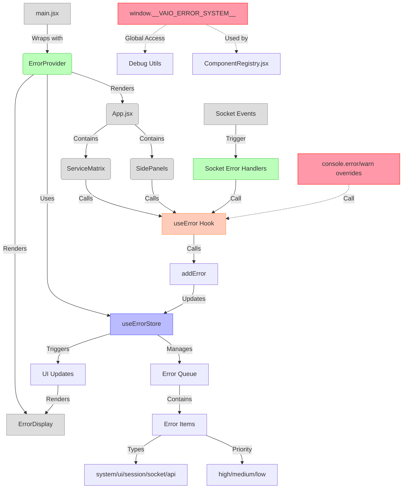
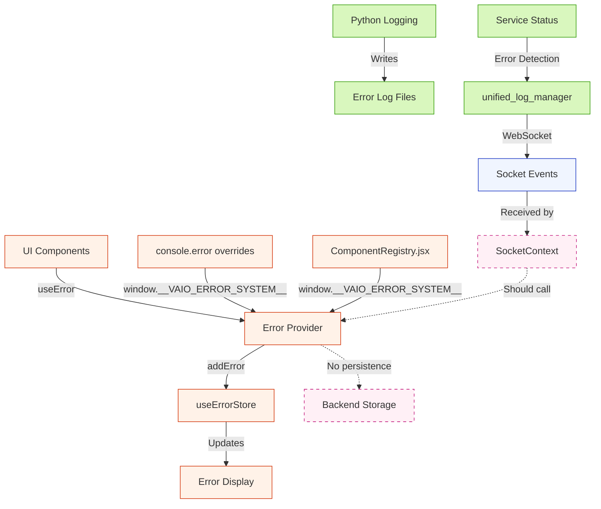

# Error System Architecture Diagram
1. App Entry
   └─ main.jsx
       └─ wraps <App /> with <ErrorProvider>

2. ErrorProvider Responsibilities
   ├─ Initializes internal state (errors[], shownErrors, dismissedErrors)
   ├─ Registers global window.__VAIO_ERROR_SYSTEM__
   ├─ Renders <ErrorDisplay> with sorted + visible errors

3. Error Sources
   ├─ UI calls useError().showError() from:
   │   ├─ ServiceMatrix
   │   └─ SidePanels
   ├─ Console.error / console.warn overrides
   └─ Socket telemetry (e.g., servicesWithErrors, errorLogs)

4. Error Handling Flow
   ├─ showError(message, type)
   │   ├─ Skips if in dismissedErrors (within 1 min)
   │   ├─ Skips if in shownErrors (within debounce period)
   │   └─ Adds new error to top of list
   └─ hideError(id)
       └─ Marks message as dismissed and removes from state

5. Error Rendering
   └─ ErrorDisplay
       └─ Maps errors to <ErrorItem> with fly-up animation
           ├─ translateY(100%) → 0
           └─ top = index * 65px

6. Problem Zones
   ├─ Global window object is tightly coupled
   ├─ Console overrides may inject benign logs
   └─ Errors dismissed by user may resurface unless suppressed




## Error Flow Description

1. **Initialization Flow**
   - `main.jsx` initializes the app with `ErrorProvider`
   - `ErrorProvider` uses `useErrorStore` for state management
   - `ErrorProvider` renders `ErrorDisplay` for showing errors

2. **Error Generation Sources**
   - **UI Components**: ServiceMatrix and other components call `useError().showError()`
   - **Socket Events**: Socket error events call error handlers
   - **Console**: Overridden console.error/warn methods trigger errors
   - **Global Access**: ComponentRegistry.jsx and other non-React code access via window.__VAIO_ERROR_SYSTEM__

3. **Error Processing**
   - Errors are added to the store via `addError`
   - Store deduplicates errors (5-second window)
   - Errors are categorized by type and priority
   - UI is updated to show error notifications

4. **Problem Areas**
   - Global window object creates tight coupling
   - Console overrides capture all errors indiscriminately
   - Multiple error handling patterns across components
   - Session checks potentially triggered by error dismissal

## Backend Error Flow Diagram

```mermaid
graph TD
    %% Backend Components
    A[Python Backend Logs] -->|Writes to| B[vaio-backend.log]
    B -->|Streamed by| C[unified_log_manager.py]
    C -->|Emits| D["WebSocket Events (error_log)"]
    D -->|Received by| E[SocketContext.jsx]
    
    %% Socket Error Flow
    E -->|Updates| F[Error State in Socket Context]
    F -->|May trigger| G[Service Status Changes]
    G -->|May cause| H[Component re-renders]
    
    %% Missing Integration
    E -.->|Should call but doesn't| I[useError().showError()]
    
    %% API Error Routes
    J[routes_errors.py] -->|Returns| K[Service Errors]
    L[routes_error_logs.py] -->|Returns| M[Error Log Content]
    
    %% Current vs. Ideal Flow
    N[Frontend Errors] -.->|No path to| O[Backend Persistence]
    
    %% Classes for styling
    classDef backend fill:#d9f7be,stroke:#389e0d,stroke-width:1px;
    classDef api fill:#d6e4ff,stroke:#1d39c4,stroke-width:1px;
    classDef frontend fill:#fff2e8,stroke:#d4380d,stroke-width:1px;
    classDef missing fill:#fff0f6,stroke:#c41d7f,stroke-width:1px,stroke-dasharray: 5 5;
    
    %% Apply styles
    class A,B,C backend;
    class D,J,K,L,M api;
    class E,F,G,H,I,N frontend;
    class I,O missing;
```

## Complete Error System Integration

