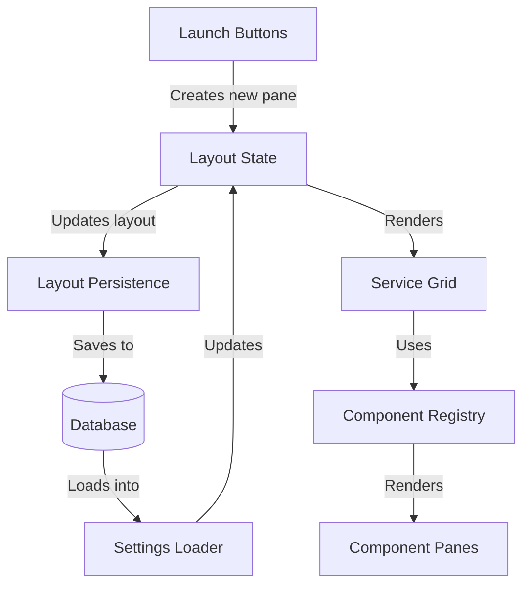

# VAIO Board Pane Launch and Persistence Flow

This document outlines the complete flow of the pane launch system in the VAIO Board project, from the database models to the launch button components. It references the indexed comments in each file, providing a comprehensive understanding of the entire system.

## System Flow Overview

## 1. Database Models (Database Layer)

The database layer consists of two main models:

- **UserSession Model** [DBM-001] - Stores the current state of a user's session, including:
  - [DBM-002] User identification metadata
  - [DBM-003] Grid layout JSON for responsive breakpoints
  - [DBM-004] List of active module IDs
  - [DBM-005] Timestamp tracking

- **PaneLayout Model** [DBM-006] - Stores saved/named layouts, containing:
  - [DBM-007] Layout name, data, and owner information

## 2. Session API Layer (Backend)

Session data is exposed through API endpoints:

- [SES-001] Session router defines endpoints for:
  - [SES-002] GET /api/user/session - Retrieve session data
  - [SES-003] PUT /api/user/session - Update entire session
  - [SES-004] PUT /api/user/session/grid - Update just grid layout

The backend handles:
- [SES-005] Session database queries
- [SES-006] Session creation for new users
- [SES-007] Session updates with validation
- [SES-008] Consistent response formatting

## 3. Frontend Settings & Context Layer

The frontend maintains session state using React Context:

- [CTX-001] SettingsContext provides:
  - [CTX-002] Initial default state
  - [CTX-003] Grid layout state and updaters
  - [CTX-004] Active modules tracking
  - [CTX-005] Provider for the component tree

## 4. Layout Management Layer

Layout management consists of several utility modules:

### 4.1 Settings Loader
- [SL-001] Responsible for loading session data:
  - [SL-003] Main loader function fetches from API [SL-004]
  - [SL-005] Extracts grid layout and module data
  - [SL-006] Updates layout state
  - [SL-007] Updates active modules state
  - [SL-008] Handles errors and applies defaults

### 4.2 Session Manager
- [SM-001] Manages session state synchronization:
  - [SM-002] Fetching and syncing session data
  - [SM-005] Refreshing session state after changes
  - [SM-007] Updating React state

### 4.3 Layout Manager
- [LM-001] Handles layout persistence operations:
  - [LM-003] Validates breakpoint structure
  - [LM-004] Validates layout item properties
  - [LM-005] Saves layouts to backend session via API
  - [LM-008] Prepares API payload

### 4.4 Layout Transformer
- [LT-001] Transforms layout data structures:
  - [LT-002] Creates empty layout structures
  - [LT-003] Validates layout items
  - [LT-005] Hydrates layouts from database/storage format
  - [LT-006] Sanitizes layouts for storage

### 4.5 Layout Positioning
- [LP-001] Provides positioning algorithms:
  - [LP-002] Defines default sizes for different module types
  - [LP-003] Retrieves sizes based on module type
  - [LP-004] Calculates optimal positions for new panes

## 5. Component System

The component system manages dynamic component loading and rendering:

### 5.1 Component Registry
- [CR-001] Core singleton for component management:
  - [CR-002] Central registry class
  - [CR-003] Module categorization by type
  - [CR-008] Module type normalization
  - [CR-009] Component registration
  - [CR-010] Component retrieval

### 5.2 Service Grid
- [SG-001] Main grid component that renders all panes:
  - [SG-002] Uses responsive grid layout
  - [SG-005] Initializes component registry
  - [SG-006] Sanitizes layout data
  - [SG-008] Renders individual panes
  - [SG-009] Processes active modules
  - [SG-010] Handles layout changes

## 6. Launch Button Components

The launch process begins with launch button components:

### 6.1 Launch Button Super
- [LBS-001] Button for launching Supervisor pane:
  - [LBS-002] Accesses layout state from context
  - [LBS-003] Launch handler function for new panes
  - [LBS-004] Defines module type and identifier
  - [LBS-005] Prevents duplicate panes
  - [LBS-006] Generates unique ID
  - [LBS-008] Creates layout items for all breakpoints
  - [LBS-010] Updates UI state
  - [LBS-011] Persists to backend
  - [LBS-012] Sends socket notification

### 6.2 Launch Button NVIDIA
- [LBN-001] Button for launching NVIDIA service pane:
  - [LBN-002] Uses dynamic importing for optimization
  - [LBN-004] Launch handler function
  - [LBN-005] Module identification
  - [LBN-008] Dynamically loads layout utilities
  - [LBN-009] Creates layout items
  - [LBN-011] Updates UI state
  - [LBN-012] Persists to backend

## Complete Flow Sequence

1. **Launch Initiation**:
   - User clicks a launch button [LBS-001/LBN-001]
   - Button handler creates a unique pane ID [LBS-006/LBN-007]
   - Layout positioning is calculated [LP-004] for all breakpoints

2. **Layout Updates**:
   - New layout items are created [LBS-008/LBN-009]
   - React state is updated [LBS-010/LBN-011]
   - Layout is saved to backend [LM-005]

3. **Backend Persistence**:
   - API receives layout update [SES-004]
   - Session is validated and updated in database [SES-007]
   - Layout is stored in UserSession model [DBM-003]

4. **Rendering**:
   - ServiceGrid [SG-001] receives updated layout
   - Active modules are processed [SG-009]
   - Component Registry [CR-001] provides components
   - Panes are rendered into grid [SG-008]

5. **Session Loading**:
   - On page load, SettingsLoader [SL-001] fetches session
   - SessionManager [SM-001] synchronizes state
   - Layout Transformer [LT-001] hydrates layouts
   - UI state is updated with session data

## Key Observations

1. **Three-Part ID System**: Panes use a three-part ID format (`type-identifier-instance`) for consistent identification across the system.

2. **Responsive Layout Structure**: All layouts maintain separate arrays for different breakpoints (lg, md, sm, xs, xxs).

3. **Validation Layers**: Multiple validation steps ensure layout integrity:
   - [LM-003] Breakpoint validation 
   - [LM-004] Layout item validation
   - [LT-003] Item property validation
   - [SG-006] Layout sanitization

4. **Backend Synchronization**: Changes to layouts are persisted to the backend, ensuring consistency between sessions.

5. **Dynamic Component Loading**: The Component Registry [CR-001] enables dynamic loading and rendering of different pane types.

## Conclusion

The pane launch system follows a clear flow from user interaction to database persistence and back to rendering. The modular approach with specialized utility files makes the system maintainable and extensible. The system effectively handles complex tasks like optimal positioning, layout validation, and responsive grid management.
